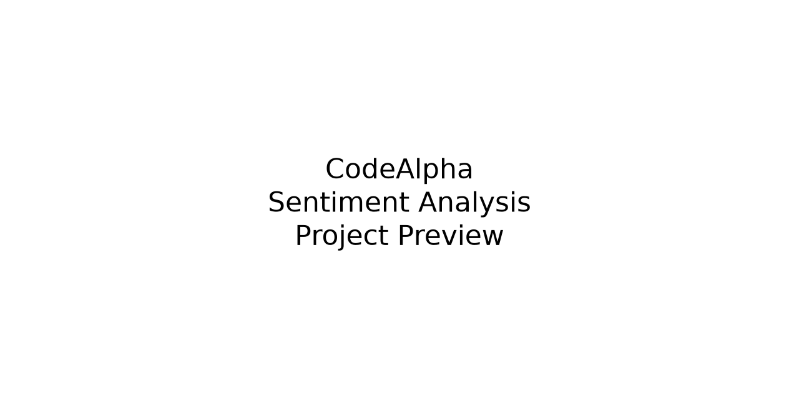

# CodeAlpha Sentiment Analysis



## Table of Contents
- [Project Overview](#project-overview)
- [Objectives](#objectives)
- [Features](#features)
- [Technology Stack](#technology-stack)
- [Project Architecture](#project-architecture)
- [Folder Structure](#folder-structure)
- [Installation Guide](#installation-guide)
- [Usage](#usage)
- [Output](#output)
- [Screenshots](#screenshots)
- [Future Improvements](#future-improvements)
- [License](#license)
- [Author](#author)

## Project Overview
This project is a complete beginner-friendly sentiment analysis application built for the CodeAlpha Data Analytics Internship. It loads product reviews, cleans the text, performs sentiment analysis using TextBlob, detects emotions using keyword-based logic, and generates professional charts and CSV exports.

## Objectives
- Classify reviews as Positive, Negative, or Neutral
- Detect emotions such as Happy, Excited, Love, Angry, Sad, Fear, and Neutral
- Generate professional visualizations for analysis
- Create a portfolio-ready project for GitHub and LinkedIn

## Features
- Load CSV review data
- Clean and preprocess text
- Perform polarity-based sentiment analysis
- Detect emotions from review text
- Generate bar chart, pie chart, and word cloud
- Export processed results to CSV
- Display a polished console summary
- Automatically create output folders and sample datasets

## Technology Stack
- Python
- Pandas
- Matplotlib
- TextBlob
- WordCloud
- NLTK
- Scikit-learn

## Project Architecture
```text
Dataset
↓
Text Cleaning
↓
Tokenization
↓
Sentiment Analysis
↓
Emotion Detection
↓
Visualization
↓
CSV Export
```

## Folder Structure
```text
CodeAlpha_SentimentAnalysis/
├── data/
│   ├── amazon_reviews.csv
│   └── sample_reviews.csv
├── output/
│   ├── sentiment_results.csv
│   ├── sentiment_chart.png
│   ├── wordcloud.png
│   └── pie_chart.png
├── screenshots/
├── app.py
├── requirements.txt
├── README.md
├── LICENSE
└── .gitignore
```

## Installation Guide
1. Clone the repository.
2. Navigate to the project folder.
3. Install dependencies:
   ```bash
   pip install -r requirements.txt
   ```
4. Run the application:
   ```bash
   python app.py
   ```

## Usage
The application automatically creates the dataset if it is missing and saves the processed results to the output folder.

## Output
The project generates:
- Processed CSV: output/sentiment_results.csv
- Bar chart: output/sentiment_chart.png
- Pie chart: output/pie_chart.png
- Word cloud: output/wordcloud.png

## Screenshots
- Terminal preview: screenshots/terminal_output.png
- Sentiment chart: screenshots/sentiment_chart.png
- GitHub portfolio preview: screenshots/github_repo.png

## Future Improvements
- Add a web dashboard with Streamlit or Flask
- Integrate real-world review datasets
- Add multilingual sentiment analysis
- Deploy the app online

## License
This project is licensed under the MIT License.

## Author
Created by a Python developer for the CodeAlpha Data Analytics Internship.
